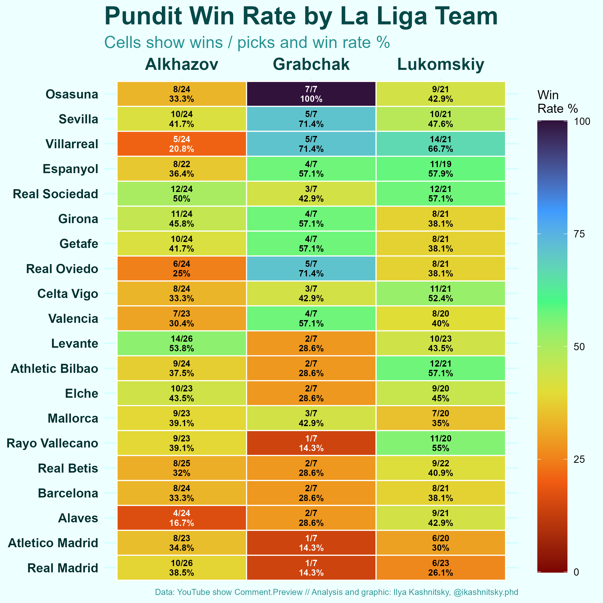

# La Liga Preview Pundits' Odds Analysis

## Description

This project analyzes the predictions made by three Russian pundits, [Vadim Lukomskiy](https://t.me/lukomski), [Denis Alkhazov](https://t.me/alhasbro), and [Vladimir Grabchak](https://t.me/barcafamilyyy), for La Liga matches in the 2025-2026 season, up to matchday 28. Please note that there were no predictions made for matchdays 6 and 18.

The analysis is based on podcast episodes where these predictions were made. I made screenshots of the predictions (you can fund them in `dat/screenshots`) and with the help of Gemini and Claude compiled them into a clean table `dat/full-table-odds`. The R script `src/laliga-predictions-outcomes.R` processes the data and generates visualizations.

## Data

The data used in this analysis is located in the `dat/` directory and consists of:

*   **`dat/full-table-odds.csv`**: A table of predictions compiled from screenshots of the podcast episodes. This was done with the help of Gemini and Claude.
*   **`dat/laliga-played-matches.csv`**: A dataset of all played matches in the season with final scores. This was used to help decipher team names.
*   **`dat/screenshots/`**: Screenshots of the predictions from the podcast.

The original podcast episodes can be found here: [La Liga Preview Playlist](https://youtube.com/playlist?list=PLZgJT1M3SJ9XVvZFlcJeCKUMzrMYCrCwc&si=RVs-ryd-bKHXuOBB) [IN RUSSIAN]

Some of the early analysis performed by Claude in python and translated into R can be found here: [Perplexity AI Search](https://www.perplexity.ai/search/here-i-have-a-table-with-perfo-J8InuNP2Q5yiMH9oPnjDbw)

## Usage

To run the analysis, execute the R script:

```R
source("src/laliga-predictions-outcomes.R")
```

The script uses several R packages, which you may need to install:

*   `tidyverse`
*   `janitor`
*   `devtools`
*   `sysfonts`

## Output

The script generates a plot of pundit win rates by La Liga team, which is saved as `out/by-team.png`.


